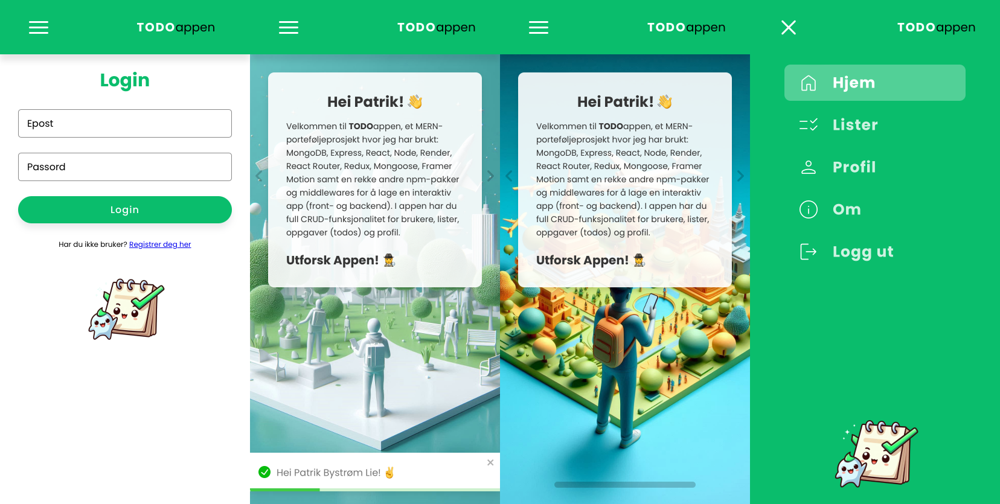
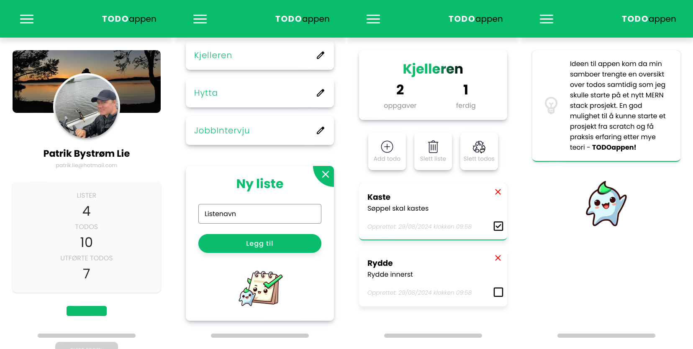
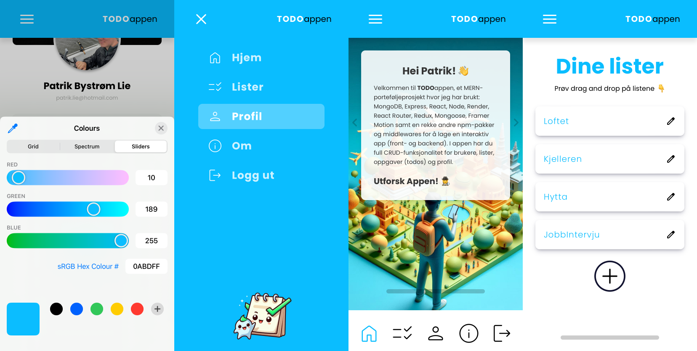

# TODOappen

## Beskrivelse
Velkommen til TODOappen, et MERN-porteføljeprosjekt hvor jeg har brukt: MongoDB, Express, React, Node, Render, React Router, Redux, Mongoose, Framer Motion samt en rekke andre npm-pakker og middlewares for å lage en interaktiv app (front- og backend). I appen har du full CRUD-funksjonalitet for brukere, lister, oppgaver (todos) og profil.

## Teknologier frontend
- **React**
- **Redux Store**
- **JavaScript (ES6+)**
- **Axios**
- **React Router**
- **CSS Media Queries og CSS Variabler**
- **Google Symbols**
- **flaticons**
- **react lordicons**
- **framer-motion**
- **hamburger-react**
- **react-toastify**

## Teknologier backend
- **bcrypt**
- **cloudinary**
- **cors**
- **dotenv**
- **express**
- **joi**
- **jsonwebtoken**
- **mongoose**
- **mongodb**
- **multer**

## Installasjon
1. Klon repoen: `git clone https://github.com/patriklie/todo-appen.git`
2. Naviger inn i både client mappen og backend mappen 
3. Installer avhengigheter med: `npm install` eller 'npm i'
4. Etter at alle avhengigheter er installert front og backend må du lage egne enviromentals filer

5. ENV backend må inneholde: 
PORT=5000
MONGODB_URI=
SECRET_KEY=
CLOUDINARY_CLOUD_NAME=
CLOUDINARY_API_KEY=
CLOUDINARY_API_SECRET=
6. ENV frontend må innholde:
REACT_APP_API_BASE_URL=http://localhost:5000
7. Så starter du opp serveren lokalt fra backend mappen med "nodemon server.js"
8. Så kjører du 'npm start' i frontend

## Screenshot fra Appen vist på en iphone 11:

## Bidrag
Åpen for bidrag. Vennligst lag en pull request hvis du har forbedringer
